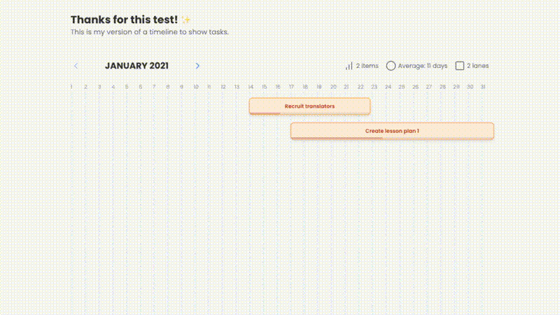

# Timeline Component - Airtable Challenge

## 🎥 Demo



*Interactive timeline component demonstration*

## ✅ What I liked about my implementation

- I was able to define **small, reusable components** that are easy to maintain.
- The final result has a **clean and simple design**.
- Using **TailwindCSS** made styling much easier and more consistent.
- Using **TypeScript** brought more type safety and improved the development experience.
- Visual duration indicators to help users quickly identify task complexity and schedule density.

---

## 🔄 What I would change if I were to do it again

- I would invest more time in **responsiveness**, especially for mobile views.
- I would improve how the time samples are sliced, maybe by **weeks** or **fortnights**, to make it easier to read.
- I would **componentize basic elements** like buttons and text to maintain consistent styling and simplify design decisions.
- I would implement proper **accessibility features** (ARIA tags, keyboard navigation, screen reader support) to make the timeline usable for everyone.
- Although I started implementing features like **inline editing**, there wasn't enough time to persist the changes globally — but it is possible to simulate the behavior.
- I really liked the **month pagination**, which already adds a lot of simplicity to the overall timeline view.

---

## 🎨 How I made design decisions

- I was inspired by some well-known timelines, like those used by **Google**.
- I adapted the challenge to display the timeline **horizontally**, for better continuity and readability.
- I chose a style with **rounded shapes** and a **modern font** to create a softer and more pleasant UI.
- **Color psychology** was considered for the duration indicators - green for quick wins, red for attention-needed tasks.

---

## 🧪 How I would test this with more time

- I would create **unit tests** for each main component.
- I would also implement integration tests with **usage scenarios** involving manipulation of the provided data (`timelineItems.ts`).
- Scenarios like adding, editing, moving, and removing items from the timeline would be covered.
- Visual regression tests to ensure the color coding system works correctly across different data sets.

---

## 📦 How to run the project

1. Clone the repository:
   ```bash
   git clone https://github.com/JadsonSouzaDev/airtable-timeline.git
   ```

2. Navigate into the project directory:
    ```bash
    cd airtable-timeline
    ````

3. Install dependecies:
    ```bash
    npm install
    ```

4. Start the development server:
    ```bash
    npm start
    ```

## Future enhancements I'd like to add
- Zoom in/out on the timeline
- Drag-and-drop to adjust event dates
- Inline editing with persistent state
- A more compact display for mobile devices
- Filtering by duration (show only short/long tasks)
- Search functionality to find specific tasks quickly

Thanks for the opportunity to participate in this challenge! 🚀
